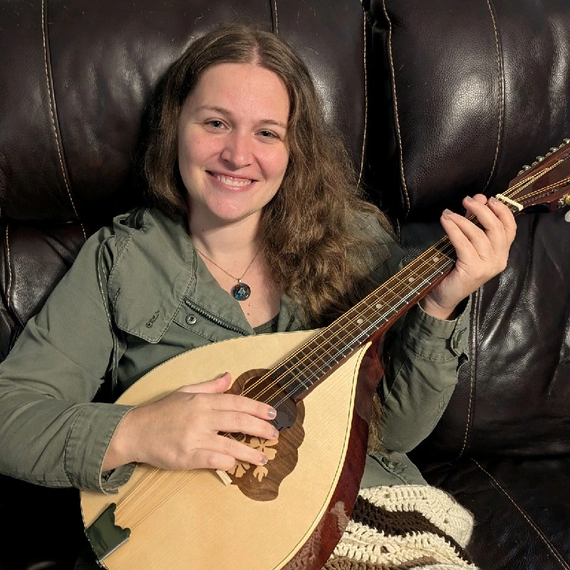
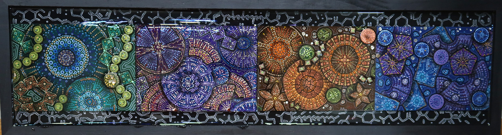
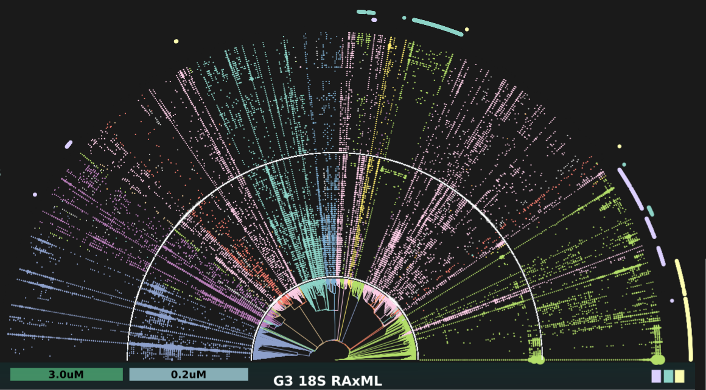
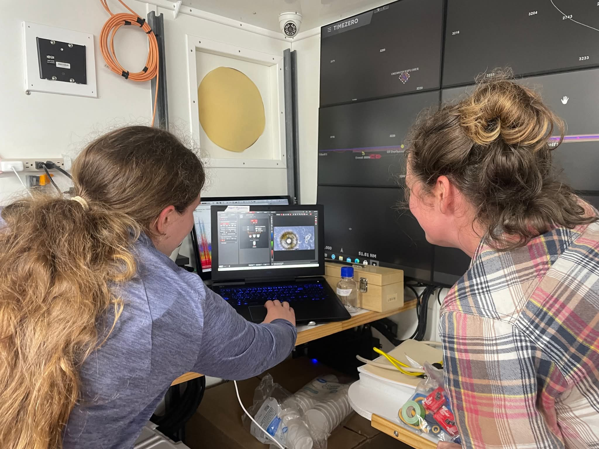
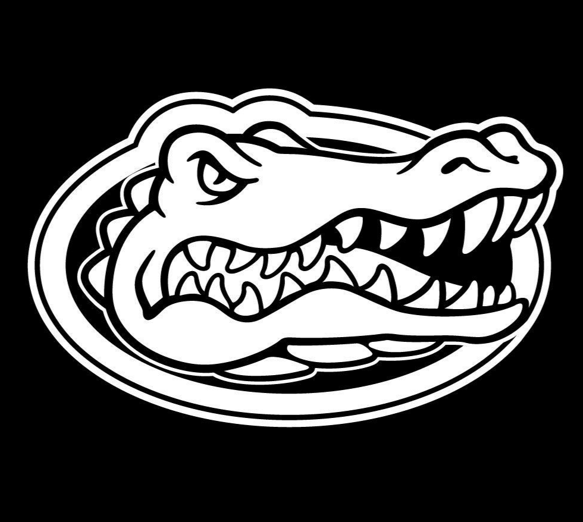

Rebecca Key

Data Scientist • Microbiology

<a href="https://www.linkedin.com/in/rkeymicrobe/">
<i class="bi bi-linkedin"></i>
</a>

<a href="https://github.com/rkeyMicrobe">
<i class="bi bi-github"></i>
</a>

  <a href="mailto:rkeyMicrobe@proton.me">rkeyMicrobe@proton.me</a>

  <a href="mailto:rebeccakey@ufl.edu">rebeccakey@ufl.edu</a>

---

::: {.panel-tabset}

## About

**I am a data scientist** who enjoys decoding complex data. My work centers on bioinformatics, biostatistics, and microbial systems, where I build reproducible analytical pipelines and apply integrative tools to uncover patterns in large, multidimensional, multi-omic datasets. 

---

The following principles guide my approach to scientific pursuit and data analysis:

- **No dataset is too complex or large**. To organize, wrangle, or transform.
- **To not know is an invitation to know**. Lets get started.   
- **DNA is DNA**. Models change, but hidden frameworks persist. 

I began my career as a molecular biologist studying bacteria–squid symbiosis and Chlamydia pathology. I later worked with plant systems, including maize and bryophytes. During the COVID-19 pandemic (when many bench experiments were paused), I built my own computer and shifted toward marine microbiology and computational analysis.

**Marine microbiology generates enormous datasets**, and the field needs scientists who can code. That realization ultimately led me to transition fully into bioinformatics and data science.

## Education

<strong>Ph.D. in Botany </strong> 
University of Florida

Courses: Bioinformatics, Genomics, Ecology

<strong>B.S. in Microbiology </strong> 
Southern Illinois University Carbondale

Courses: Molecular Microbiology, Chemistry

<strong>A.A.S. in Veterinary Technology </strong> 
Rend Lake Community College

Courses: Surgery, Pathology, Avian Medicine

:::

