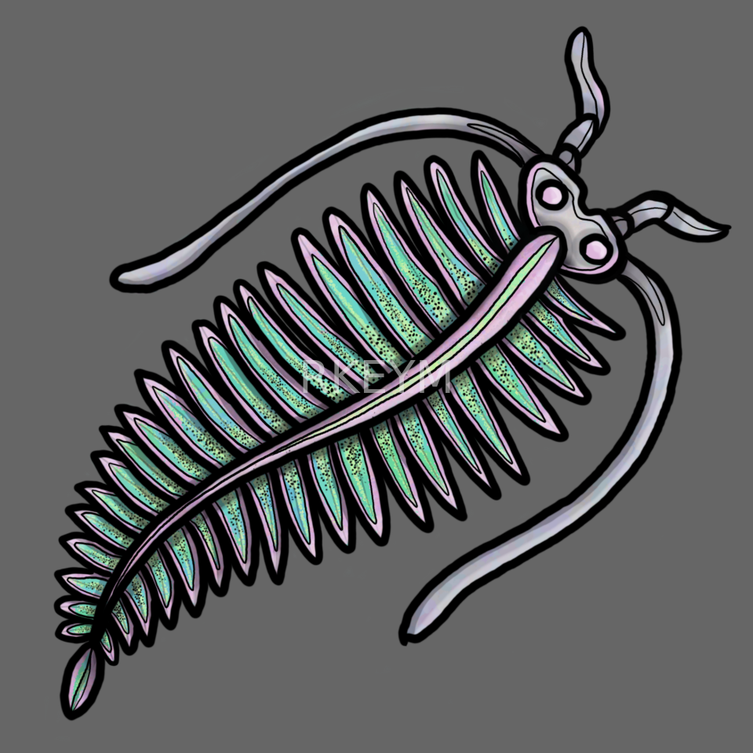

## **You drifted into a microbial bloom... **

**... of illustrations** 😜

This page hosts a collection of microbes, their hosts, and grazers (eg. zooplankton). The drawings were designed to be used for teaching materials, presentations, and academic communication.

> If you would like to use an illustration, please contact me for permission. Academic use is generally permitted with attribution. Requests for other uses (commercial applications, logo designs, or designing a full custom figure) will require a consult and pricing!
>
>**For inquiries or permissions, please email:** <rkeyMicrobe@proton.me>
>
> Please put "art" in your subject line.

---

::: {.panel-tabset}

### Phytoplankton

---

### Bacteria

---

### Hosts

---

### Zooplankton

{width=100%}

Illustration showing heterocyst formation and nitrogen fixation.

{width=100%}

Conceptual diagram of sulfur oxidation pathways.

{width=100%}

Interaction between phytoplankton and surrounding microbes.

{width=100%}

Illustration of microbial metabolite cycling.

{width=100%}

Example placeholder for additional drawings.

---

### Figure Samples

:::