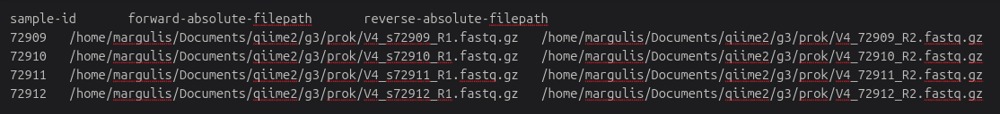

## Introduction

This pipeline uses **QIIME2** for processing **16S rRNA gene** amplicon data into amplicon sequence variants (**ASVs**). Paired-end short reads were generated using the **515F–806R** primer pair. This pipeline quality filters, trims, and denoises reads, then taxonomically classifies them using the **SILVA** reference database.

-   **Who is this for?** 
For researchers working with 16S rRNA gene amplicon datasets. They want ASV-level resolution, not OTU. They are new to QIIME and want a guided example. 

-   **Where can I run it?** 
On a local machine (eg. Linux, macOS). On a remote HPC system. 

-   **What's the end goal?** 
To produce an ASV count table, representative sequence table, and taxonomy table that links to sample metadata. These outputs can be then shuttled to R for statistical and ecological analysis. 

.

.

## Required Materials

Here is a list of required packages: 

::: {.callout-note title="REQUIRED PACKAGES"}
| Package | Version | Notes |
|---------|---------|-------|
| QIIME2 | 2022.8 | Main package for processing |
| Python, Conda | ≥ 3.8 | Dependency for QIIME2 |
| Cutadapt | in QIIME2 | Primer and adapter removal |
| DADA2 | in QIIME2 | ASV inference and denoising |
| Figaro | latest | Data-driven truncation length selection |
| FASTQC | latest | Independent read quality assessment (optional) |
| SILVA | 138+ | 515F–806R trained reference classifier |
:::

.

.

## Pipeline

### **Step 1**: The Bare Necessities

- **Python Install**


- **QIIME2 Install**

Install the QIIME2 community release (v2022.8) in a conda environment.  
Follow the official installation instructions provided by the QIIME2 developers:

<https://forum.qiime2.org/t/qiime-2-2022-8-is-now-available/23994>

```bash
conda create -n qiime2-community-2022.8-BETA \
  -c conda-forge -c bioconda \
  -c https://packages.qiime2.org/qiime2/2022.8/passed/community/ \
  qiime2-community
  
  conda activate qiime2-2022.11
``` 

.

### **Step 2**: A Good Artifact

Import your raw paired-end FASTQ files into QIIME2 and converts them into a single artifact. This is in a structure the QIIME2 package accepts. 

```bash
qiime tools import \
  	--type 'SampleData[PairedEndSequencesWithQuality]' \
  	--input-path "manifest_g3_16s.txt" \
  	--output-path "./qza/g3_16s_rawSeqs.qza" \
  	--input-format PairedEndFastqManifestPhred33V2
``` 
 - SampleData[PairedEndSequencesWithQuality]: paired-end sequencing reads with quality scores (R1 and R2 FASTQs).
 - Manifest file: maps sample IDs to FASTQ file paths in your project directory.
 - Output: creates a QIIME2 artifact (.qza) at specified location using the specified name.
 - Encoding: FASTQ files use Phred+33 (standard Illumina quality encoding).
 
 
 > 🟣 **What does the manifest file look like?** 
 > The manifest shows QIIME2 where to locate the forward and reverse reads. Click the screenshot to see:

{width=800px lightbox="true"}

 ---
 
 Now change the qz**a** to qz**v** to visualize
 
```bash
qiime demux summarize \
	--i-data "./qza/g3_16s_rawSeqs.qza" \
	--o-visualization "./qzv/g3_16s_rawSeqs.qzv" 
``` 
 - View .qzv files at <https://view.qiime2.org/>
 - Drag 'n drop 

---

OPTIONAL STEP! This will run FASTQC on a small subset of raw reads as an independent quality check, outside of QIIME2.

```bash
chmod 770 ./prok/*gz
cp ./prok/V4_515F_New_V5R_new-72909_GTATCGTCGT_R1.fastq.gz ./fastqc
cp ./prok/V4_515F_New_V5R_new-72909_GTATCGTCGT_R2.fastq.gz ./fastqc
gzip -d ./fastqc/*gz
fastqc -t 6 ./fastqc/*fastq
```
 - 'chmod' command ensures the FASTQ files are readable/executable.
 - Copies one R1 and R2 FASTQ files for sample 72909 to a working directory.
 - Decompress. FASTQC requires uncompressed FASTQ files.
 - Generates an HTML reports, lets you known per-base quality, GC content, adapter contamination, and other diagnostics.
 
.

### **Step 3**: Drop Dead Weight

This step will remove primers, adapters, and residual library sequences from the paired-end reads, then re-summarizes read quality.

```bash
qiime cutadapt trim-paired \
  --i-demultiplexed-sequences "./qza/g3_16s_rawSeqs.qza" \
  --p-cores 20 \
  --p-front-f GTGYCAGCMGCCGCGGTAA ACACTGACGACATGGTTCTACA AATGATACGGCGACCACCGAGATCT \
  --p-adapter-f TACGGTAGCAGAGACTTGGTCT CAAGCAGAAGACGGCATACGAGAT AGACCAAGTCTCTGC \
  --p-front-r GGACTACNVGGGTWTCTAAT ACACTGACGACATGGTTCTACA AATGATACGGCGACCACCGAGATCT \
  --p-adapter-r TACGGTAGCAGAGACTTGGTCT CAAGCAGAAGACGGCATACGAGAT TGTAGAACCATGTC \
  --p-discard-untrimmed \
  --p-no-indels \
  --p-error-rate 0.2 \
  --o-trimmed-sequences "./qza/g3_16s_trimmed.qza"
```
- You will need to specify available cores on your computer. The more the better. For speed. If you have 16 CPUS, type 14. 
- You will need to know your primer and adapter sequences. 
- `--p-discard-untrimmed` This discards reads where primers are not detected. 
- `p-no-indels` prevents insertions/deletions during matching.
- `--p-error-rate 0.2` allows limited mismatches so degenerate primer positions are still recognized.

---

Another OPTIONAL Step! Compare this to your previous 'qiime demux summarize'

```bash
qiime demux summarize \
	--i-data "./qza/g3_16s_trimmed.qza" \
	--o-visualization "./qzv/g3_16s_trimmed.qzv"
```
 
.

### **Step 4**: FIGARO

Figaro is a package that objectively (not subjectively) selects truncation lengths for paired-end amplicon reads prior to DADA2 denoising. Emphasis on "not subjectively". Truncation lengths are chosen based on read quality and overlap metrics than visual guesswork. 

```bash
wget http://john-quensen.com/wp-content/uploads/2020/03/figaro.yml
conda env create -n figaro -f figaro.yml
wget https://github.com/Zymo-Research/figaro/archive/master.zip
unzip master.zip
rm master.zip
cd figaro-master/figaro
chmod 755 *.py
wget https://github.com/jfq3/Miscellaneous-scripts/raw/master/test_figaro.sh
```

---

Now, we will provide Figaro with one R1 and R2 FASTQ. A single sample, in this case sample 72910, is sufficient because quality profiles are typically consistent across a Illumina seq'ing run. 

```bash
dir="./figaro-master/figaro/test_figaro"
cp ./prok/V4_515F_New_V4_806R_New-72910_GTGTATGCGT_R1.fastq.gz ${dir}
cp ./prok/V4_515F_New_V4_806R_New-72910_GTGTATGCGT_R2.fastq.gz ${dir}

gzip -d ${dir}/*.fastq.gz
```

---

Rename them to easier names and run them into Figaro's Python script (.py)

```bash
mv ${dir}/V4_515F_New_V4_806R_New-72910_GTGTATGCGT_R1.fastq ${dir}/sam1_16s_R1.fastq
mv ${dir}/V4_515F_New_V4_806R_New-72910_GTGTATGCGT_R2.fastq ${dir}/sam1_16s_R2.fastq

cd ./figaro-master/figaro
python figaro.py -i ./test_figaro/ -o ./test_figaro/ -f 10 -r 10 -a 253 -F zymo
cd ./test_figaro
less trimParameters.json
```
- `-f 10 -r 10` are minimum overlap requirements (forward/reverse).
- `-a 253` this is expected amplicon length (after primer removal).
- `-F zymo` is the scoring model appropriate for Illumina data.
- `less` will open up the .json file.

---

The top entry you see shows the recommended forward and reverse truncation length. Choose the highest percent score where expected errors are not ≥ 3. I expect the F and R will overlap by 12 nt. 

```bash
q           # To exit out of the .json
cd ../../.. # Go back to the starting position in your working directory
```

.

### **Step 5**: DADA2 

Now, it is time to denoise, merge, and infer ASVs from the primer-trimmed paired-end reads.

```bash
qiime dada2 denoise-paired \
  --i-demultiplexed-seqs "./qza/g3_16s_trimmed.qza" \
  --p-trunc-len-f 244 --p-max-ee-f 2 \
  --p-trunc-len-r 49  --p-max-ee-r 2 \
  --p-n-threads 20 \
  --o-representative-sequences "./qza/g3_16s_reprSeqs.qza" \
  --o-table "./qza/g3_16s_reprSeqs_countTable.qza" \
  --o-denoising-stats "./qza/g3_16s_denoiseStats.qza"
```

- `--p-trunc-len-f`, `--p-trunc-len-r`: Truncates reads at the Figaro-selected positions. 
- `--p-max-ee-f/r 2`: Reads with >2 expected errors are discarded.

Congrats! We have a table of **representative sequences** and the **count table** ✨🥳.

.

### **Step 6**: Taxonomy

For this step, you may run taxonomy classification either on an HPC system or on your local machine. Classification with the SILVA database can exceed typical RAM limits, which is why an HPC environment is generally preferred. But the step can be run locally if sufficient memory is available. The alignment will run slower and your computer will be working hard. 

> Stop here! **You will need to pre-trained Classifier in QIIME2 before moving forward.** Refer to this tutorial to pre-train a classifier... [QIIME2 Classifer](./side.qmd){.btn .btn-primary .me-2}

::: {.panel-tabset}

### HPC System

On an HPC system, like HiperGator, make a SLURM script. This script submits a taxonomy classification job to an HPC system, assigning taxonomy to ASVs using a pre-trained SILVA classifier in QIIME 2.

First, place your required inputs in the appropriate working directory. Only two files are needed:
- `silvaClassifier.qza`   
- `reprSeqs.qza`

Second, log into your HPC system and navigate to your working folder. Once resources are available, open a new script file by typing:

```bash
nano
```

Third, paste: 

```bash

#!/bin/bash
#SBATCH --job-name=outFiles/taxclass.%j
#SBATCH --ntasks=1
#SBATCH --cpus-per-task=8
#SBATCH --nodes=1
#SBATCH --mem=400GB
#SBATCH --account=b.durham
#SBATCH --qos=b.durham-b
#SBATCH -t 95:00:00
#SBATCH --partition=hpg-milan
#SBATCH --output=outFiles/taxclass.%A.out
#SBATCH --array=1-1

date;hostname;pwd
 
module load qiime2/2022.8

dir="g3/qza/" # Change to fit your pathway structure

qiime feature-classifier classify-sklearn \
  --p-n-jobs 8 \
  --i-classifier "./${dir}/silvaClassifier_nr99_515F.806R.qza" \
  --i-reads "./${dir}/g3_16s_reprSeqs.qza" \
  --o-classification "./${dir}/g3_16s_reprSeqs_taxAligned.qza"
  
```

Finally, save the file and exit the editor, then submit the job with:

```bash
sbatch taxclass.sh
``` 

### Local System

> Note!  
> Taxonomy classification with SILVA can exceed normal memory (ie. RAM) limits. If this command fails locally, reduce `--p-n-jobs` or run on an HPC system

```bash
qiime feature-classifier classify-sklearn \
  --p-n-jobs 4 \
  --i-classifier "./qza/silvaClassifier_nr99_515F.806R.qza" \
  --i-reads "./qza/g3_16s_reprSeqs.qza" \
  --o-classification "./qza/g3_16s_reprSeqs_taxAligned.qza"

```


:::

.

### **Step 7**: Export Files

Almost done! Now, we have to export .qza files, convert to BIOM format, then to tab-deliminated table (.tsv). These file types can be opened, viewed, and pushed into R-studio on a local computer.

---

1️⃣ **Count Table** = ASV-by-sample count matrix

```bash

# qza to BIOM
qiime tools export \
  --input-path "./qza/g3_16s_reprSeqs_countTable.qza" \
  --output-path "./phyloseq"
  
# BIOM to tsv
biom convert \
  -i "./phyloseq/feature-table.biom" \
  -o "./phyloseq/g3_16s_countTable.tsv" \
  --to-tsv

# Clean the header for compability with R
sed -i '1d' ./phyloseq/g3_16s_countTable.tsv
sed -i 's/#OTU ID//' ./phyloseq/g3_16s_countTable.tsv
  
```

---

2️⃣ **Representative Table** = ASV sequences

```bash

# qza to fasta
qiime tools export \
  --input-path "./qza/g3_16s_reprSeqs.qza" \
  --output-path "./phyloseq"

# fasta to two-column text file
awk 'BEGIN{RS=">"}{print "#"$1"\t"$2;}' ./phyloseq/dna-sequences.fasta | \
  tail -n+2 > ./phyloseq/g3_16s_dnaSeqs.txt
  
```

---

3️⃣ **Taxonomy Table** = ASV taxonomy classifications

```bash

# qza to tsv
qiime tools export \
  --input-path "./qza/g3_16s_reprSeqs_taxAligned.qza" \
  --output-path "./phyloseq"

# rename file
mv ./phyloseq/taxonomy.tsv ./phyloseq/g3_16s_taxonomy.tsv

```