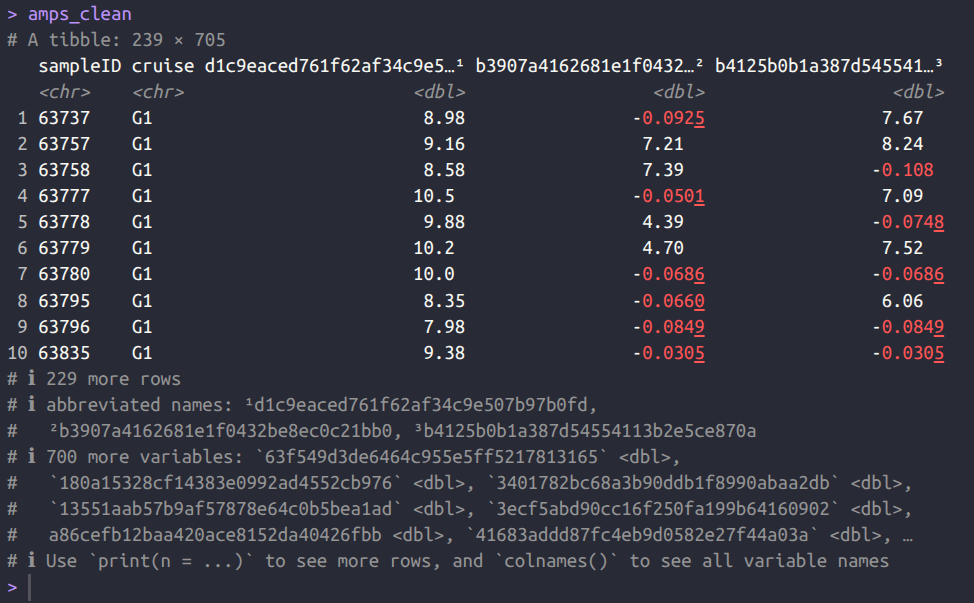
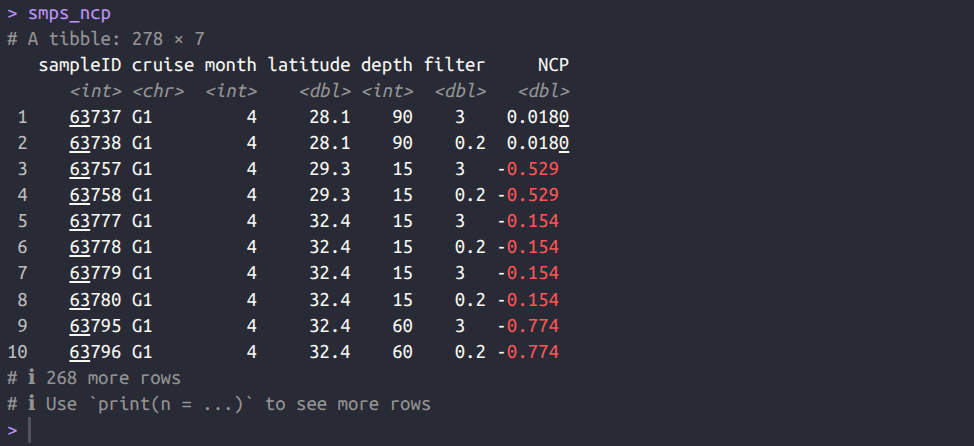
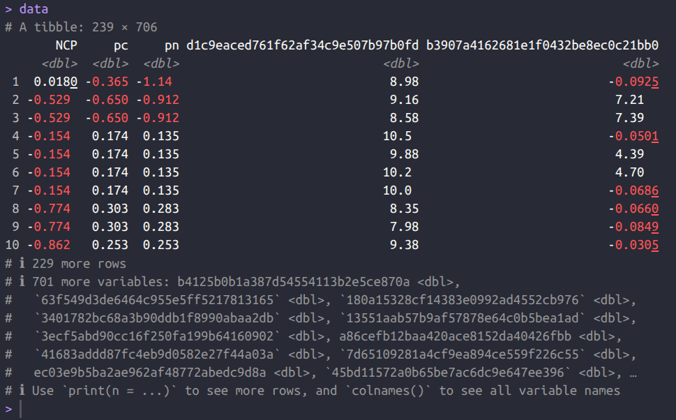
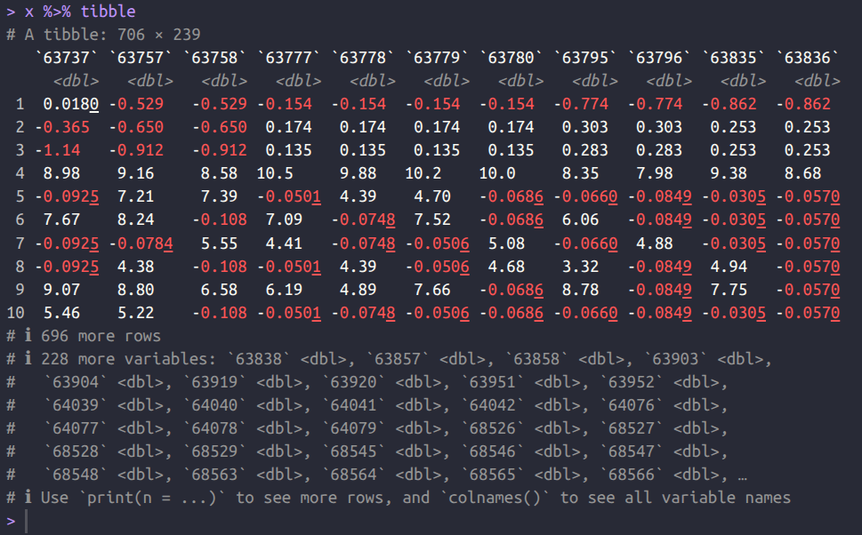
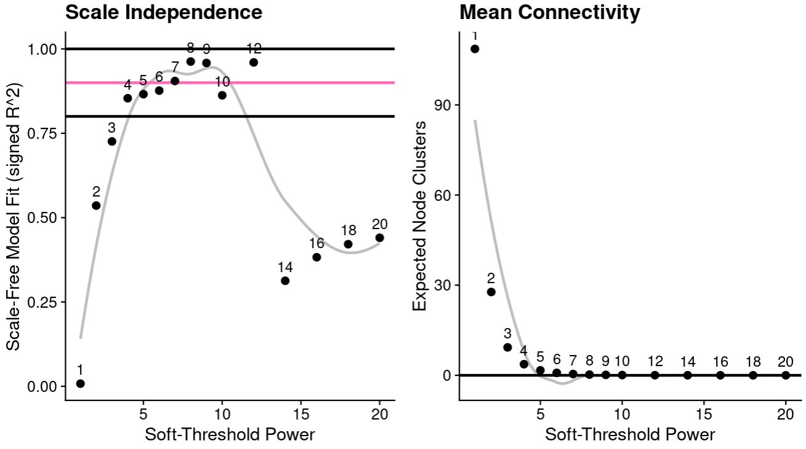
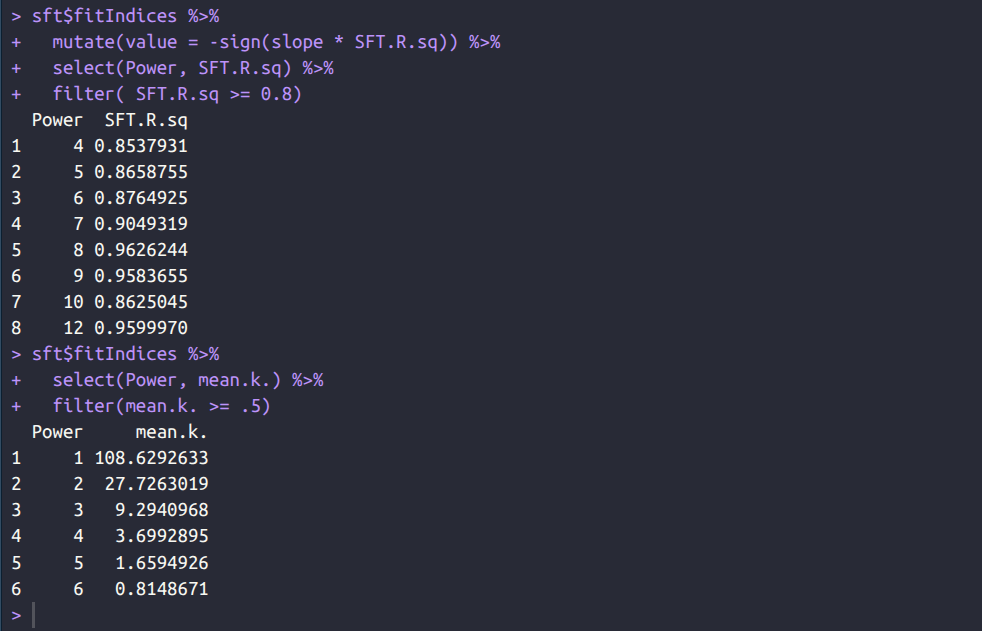
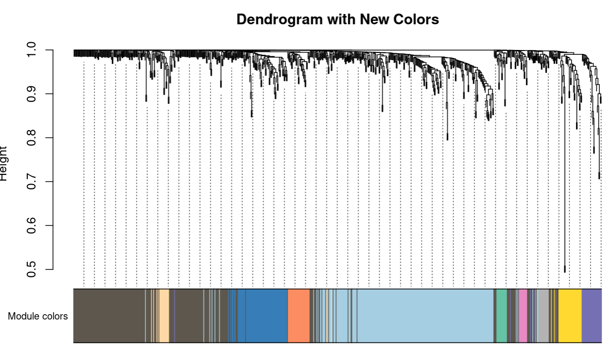
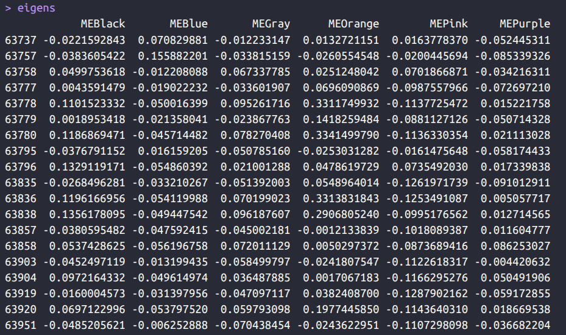
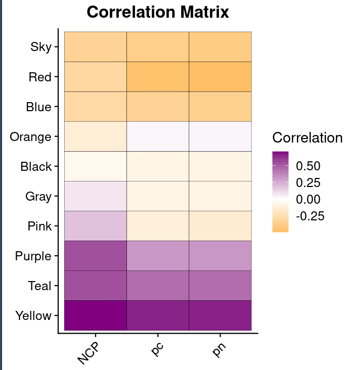

## Introduction

This pipeline performs Weighted Gene Co-expression Network Analysis (WGCNA) on amplicon data to identify groups of microbes (modules; clusters) that co-vary across samples and associate with environmental variables.

The workflow integrates CLR-transformed ASV abundance data with biogeochemical measurements to construct correlation networks and identify microbial modules linked to ecosystem processes.

> 🟡 ASVs are compositional (proportional) data; environmental variables are continuous (absolute) measurements.

-   **Who is this for?** 
Researchers analyzing microbial community datasets who wish to link microbial data to environmental gradients data. 

-   **Where can I run it?** 
On a local machine (eg. Linux, macOS). On a remote HPC system. Network construction can be memory-intensive for large datasets. Be wary of this! 

-   **What's the end goal?** 
To make Cytoscape network files (nodes & edges), identify clusters of co-varying ASVs, and compute module–trait correlations linking microbial modules to environmental variables.

> 🟡 Microbe datasets contain hundreds to thousands of ASVs. Making DENSE networks. The focus is how groups of ASVs relate to environmental gradients, not individual ASV–ASV correlations. Plus, compositional data doesn't fully meet WGCNA assumptions. So you can't do it. More details later...

## Required Materials

This walkthrough assumes proficiency with R & RStudio, but not with WGCNA. The RStudio version I used for this was “Cucumberleaf Sunflower” v2023.12.1+402. Key WGCNA concepts are explained throughout the tutorial. 

Here is a list of required packages: 

::: {.callout-note title="REQUIRED R PACKAGES"}


| Package | Purpose |
|---------|---------|
tidyverse      | Data manipulation & plotting               |
WGCNA	     | Network construction & module detection    |
compositions	| normalization for compositional data       |
bestNormalize	| normalization for biochem data             |
feather	     | Fast dataframe I/O (OPTIONAL)              |
cowplot	     | my style for plots                         |
viridis	     | Color palettes                             |
flextable	     | Publication tables                         |
webshot2	     | Export tables as images                    |
:::

---

## Pipeline

### **Step 1: Load in Data**

First: Make sure you have a clean workspace

```R

# Clean workspace and unload loaded packages
lapply(names(sessionInfo()$otherPkgs), function(pkg) {
  detach(paste0("package:", pkg), unload = TRUE, character.only = TRUE)
})
rm(list = ls()); gc(); cat("\014")

```

Second: I set a plotting theme (a personal, yet consistent theme for your plots). I also recommend setting script output path variables. You are telling where you'd like your outputs to go. Which folders. During any saving of files and plots. 

```R

# Set  Themes
theme_set(theme_cowplot())
facet_theme <- theme(strip.background = element_rect(fill = "#44475A"),
                     strip.text = element_text(color = "white", face = "bold"))

# Set Paths
dat_dir = "data_out/09_wgcna/dataframes/"
fig_dir = "data_out/09_wgcna/figures/"
tab_dir = "data_out/09_wgcna/tables/"
lmm_dir = "data_out/07_lmGmatrix/dataframes/"
in_dir = "data_out/02_qiime2_asv/dataframes/"

```

Now, load in the CLR-transformed amplicon data

```R

# Fetch amplicons
amps_clean <- read_feather(paste0(lmm_dir, "g123_phytos_clrData.feather"))

```
 > 🟣 **Why do we CLR?** 
 > CLR transformation is used because ASV dataframes are compositional. Each sample is constrained by sequencing depth. CLR transforms it to log-ratios relative to the geometric mean of each sample. Makes it suitable for standard correlation and multivariate analyses. 

 > 🟣 **Why does the amplicon dataframe look like?**
 > SampleID as rows. ASVs as column names. Cruise is which dataset year, important for my work only. 
 
{width=800px lightbox="true"}

```R
############################################################################################
# LOAD IN PHYSIOCHEMICAL VARIABLES
variables = "allVars" # We are looking at all variables: NCP, POC, and PON
############################################################################################

# Fetch normally distributed values
smps_ncp <- read.csv(paste0(lmm_dir, "boxcox_NCP.csv")) %>% tibble
smps_poc <- read.csv(paste0(lmm_dir, "boxcox_POC.csv")) %>% tibble
smps_pon <- read.csv(paste0(lmm_dir, "boxcox_PON.csv")) %>% tibble
```
- **POC** = particulate organic carbon; **PON** = nitrogen; **NCP** = net community production.
- boxcox = **Box–Cox transformed** = it makes continuous variables normally distributed. This improves the performance of statistical methods that assume normality or homoscedastic variance.

 > 🟣 **What does the biochem variable dataframes look like?**  Here's what one of them looks like, with associated meta data: 
 
{width=800px lightbox="true"}

---

.

.

### **Step 2: Integration**

This step aligns the amplicon data with environmental measurements so that (1) all datasets contain the same samples and (2) everyone is in the same order before we pass contents over to WGCNA.

First, let's subset. 

```R

# Find samples shared between amps and the 3 environment variables
length(amps_clean$sampleID)
temp_smps <- Reduce(intersect, list( # Only look to see how many NCP samples
  amps_clean$sampleID,
  smps_ncp$sampleID
))
length(amps_clean$sampleID)
length(temp_smps)

shared_smps <- Reduce(intersect, list( # Consider NCP, POC, and PON
  amps_clean$sampleID,
  smps_ncp$sampleID,
  smps_poc$sampleID,
  smps_pon$sampleID
))
length(shared_smps)

# Handle Var datasets, make all three into one dataframe based on above filtering
cleanUp <- function(data = NULL, smp_list = NULL, column = NULL){
  data %>% filter(sampleID %in% smp_list) %>% 
    select(sampleID, {{column}})
}
vars <- smps_ncp %>% filter(sampleID %in% shared_smps) %>% 
  left_join(., cleanUp(data = smps_poc, smp_list = shared_smps, column = pc)) %>% 
  left_join(., cleanUp(data = smps_pon, smp_list = shared_smps, column = pn))
```

Now, let's force identical sample ordering across all datasets. This will combine microbes + environmental variables into one WGCNA input. 

```R
# Handle Amplicon dataset and chronologically order samples based on var dataset
x <- amps_clean %>% filter(sampleID %in% shared_smps) %>% as.data.frame()
dim(x)
rownames(x) <- x$sampleID
rows_to_order <- intersect(vars$sampleID, rownames(x))
x <- x[rows_to_order, ]
amps_clean <- x %>% tibble

# Bind the Var dataset with Amp datset
data <- cbind(vars %>% select(NCP, pc, pn), 
              amps_clean) %>% tibble %>% 
  relocate(sampleID, .before = NCP) %>% 
  select(-cruise, -sampleID)
```

 > 🟣 **What does the biochem + ASV dataframe look like now?** 
 
{width=800px lightbox="true"}

Lastly, let's make one more final adjustment for WGCNA. **We need to transpose.** Samples as columns, features (ie. ASVs + biochem variables) as rows.

```R
# transpose for samples as columns
x <- as.data.frame(t(data))
colnames(x) <- as.character(amps_clean$sampleID)
x %>% tibble
```
{width=800px lightbox="true"}

✨
✨
All done!
✨
✨

.

.

---

### **Step 3: The Powers that Be**

We have the data input. Now we need to call a soft-thresholding power before WGCNA network construction. The goal is to choose a power that produces a network with **scale-free topology**. 

> 🟡 **What is scale-free topology?** This is a network where most nodes have few connections, and a small number of nodes have many connections. In other words: most microbes co-vary with only a few others, while others act as highly connected hubs. We choose a power that transform the correlation network to approximate this structure.

Let's see power results... 

```R

## Define optimal power values
powers = c(1:10, seq(from = 12, to = 20, by = 2)) 
sft = pickSoftThreshold(df, powerVector = powers, verbose = 5) 

```
 - I am creating a vector of power values to test (1 to 20).
 - ⬆️ power = strengthens strong correlations = shrinks weak correlations toward zero.
 - `pickSoftThreshold`. Tests each power and provides diagnostic metrics.
 
**Now, I generate some plots to evaluate: **

```R

p1 <- sft$fitIndices %>% 
  mutate(value = -sign(slope * SFT.R.sq)) %>% 
  select(Power, SFT.R.sq) %>% 
  ggplot(., aes(x = Power, y = SFT.R.sq)) +
  geom_smooth(method = "loess", se = FALSE, colour = "gray") +
  geom_hline(yintercept = 0.9, colour = "hotpink", size = 1) +
  geom_hline(yintercept = 0.8, colour = "black", size = 1) +
  geom_hline(yintercept = 1, colour = "black", size = 1) +
  geom_point(size = 2.5) +
  geom_text(aes(label = Power), vjust = -0.8, size = 4) + 
  labs(x = "Soft-Threshold Power", 
       y = "Scale-Free Model Fit (signed R^2)",
       title = "Scale Independence") +
  theme_cowplot() + theme(legend.position = "none")
p2 <- sft$fitIndices %>% 
  select(Power, mean.k.) %>% 
  ggplot(., aes(x = Power, y = mean.k.)) +
  geom_smooth(method = "loess", se = FALSE, colour = "gray") +
  geom_hline(yintercept = 0, colour = "black", size = 1) +
  geom_point(size = 2.5) +
  geom_text(aes(label = Power), vjust = -0.8, size = 4) + 
  labs(x = "Soft-Threshold Power", 
       y = "Expected Node Clusters",
       title = "Mean Connectivity") +
  theme_cowplot() + theme(legend.position = "none")  
p <- plot_grid(p1, p2); p

```

 {width=800px lightbox="true"}
 
> As an ecologist, I would focus on two criteria
>  (1) achieving scale-free topology.
>  (2) maintaining enough network connectivity.

::: {.panel-tabset}

#### Left Plot

The goal is to identify the lowest power where the scale-free fit (R²) reaches ~0.8 to 0.90. You want a biological network that shows an familiar biological pattern: most nodes have few connections while a small number act as highly connected hubs. Very high powers can make the network too sparse and remove weaker association that can still be biologically meaningful.

> If R² never reaches 0.8, select the highest stable point before connectivity collapses.

#### Right Plot

The goal is to make sure the network does not become too sparse. WGCNA groups ASVs into clusters (ie. modules). So we choose a power that maintains enough connectivity to detect modules without over- or under-clustering the network.

#### Combining Both

You must look at both plots to come up with a suitable power. We want the lowest power that satisfies both Scale Independence (left) and Mean Connectivity (right). 

**For my analysis, I chose a power of 6.**

- Scale free topology is close to 0.9 (pink line).
- Connectivity is still present (above 0 clusters).

```R
sft$fitIndices %>% 
  mutate(value = -sign(slope * SFT.R.sq)) %>% 
  select(Power, SFT.R.sq) %>% 
  filter( SFT.R.sq >= 0.8)

sft$fitIndices %>% 
  select(Power, mean.k.) %>% 
  filter(mean.k. >= .5)
```

 {width=800px lightbox="true"}

:::

> 🔴 **VERY IMPORTANT!** Test multiple power values (ie. each power = 1 network). The chosen power strongly influences network structure. If similar ASV modules appear across powers, we have more confidence to conclude that the patterns we are seeing reflect real co-variation, NOT artifacts of parameter choice. Or what looks (subjectively) good to report or conclude.


---

.

.

### **Step 4: Network Construction**

This step shows you how to construct a WGCNA network and explains each parameter in the WGCNA command. Let's first call out important parameters:

```R
power = 6
modsize = 10
correlationMatrix <- bicor(as.matrix(df), use = 'pairwise.complete.obs')
TOM <- TOMsimilarity(correlationMatrix, TOMType = 'signed')
TOM_type <- "signed" # both positive/negative directions

```
- `power` Chosen soft-threshold power.
- `modsize` Minimum number of ASVs required to form a module.
- `bicor(use = 'pairwise.complete.obs')` Biweight midcorrelation used to calculate ASV–ASV correlations. More robust to outliers than Pearson.
- `TOM` Topological Overlap Matrix.
- `type = "signed"` We are capturing both positive and negative correlations. 


**This next command: you are officially making a network with this code chunk...**

```R

tom <- paste0(dat_dir, "2_tom_phytos_", variables, "_p", power, "_m", modsize, "_", TOM_type)

netwk = blockwiseModules(as.matrix(df), 
                         power = power, 
                         TOMType = TOM_type, 
                         TOMDenom = "min", 
                         TOM = TOM,
                         
                         # Block and Tree Options
                         deepSplit = 4, 
                         pamRespectsDendro = F, 
                         minModuleSize = modsize,
                         
                         # Module Adjustments
                         reassignThreshold = 0, 
                         mergeCutHeight = 0.25,
                         
                         # Output Options
                         numericLabels = T, 
                         verbose = 3,
                         
                         # Save TOM files
                         saveTOMs = T, 
                         saveTOMFileBase = tom)
```

You have noticed two more parameters not talked about:

- `deepsplit = 4` is higher than the default value of 2. I intentionally increase sensitivity for detecting smaller modules. For my data, connectivity at power 6 will contain few clusters (close to zero!). So increasing sensitity here helps avoid grouping many ASVs into a single large cluster. 
- `mergeCutHeight` I keep this to default. Modules with eigengene correlation ≥ 0.75 are merged. 

---

.

.

### **Step 5: First Look at Clusters**

I make my ggplots the way I like them, choosing color-blind friendly palettes. So this next chunk of code is changing WGCA default colors to my own colors. 

```R

# Custom Names for network clusters
custom_names <- c(
  "yellow"    = "Purple",
  "brown"     = "Yellow",
  "pink"      = "Teal",
  "grey"      = "Black",
  "green"     = "Red",
  "blue"      = "Blue",
  "turquoise" = "Sky",
  "red"       = "Orange",
  "magenta"   = "Pink",
  "black"     = "Gray"
)

#Get WGCNA color names and rename them
module_colors <- labels2colors(netwk$colors)
module_names <- custom_names[module_colors]
netwk$moduleColors <- module_names

# Custom colors for network clusters
custom_colors <- c(
  "Purple" = "#7570B3",  
  "Yellow" = "#FFD92F",  
  "Teal"   = "#66C2A5",  
  "Black"  = "#5D574E",  
  "Red"    = "#FC8D62",  
  "Blue"   = "#377EB8",  
  "Sky"    = "#A6CEE3",  
  "Orange" = "#FED9A6",  
  "Pink"   = "#E78AC3",  
  "Gray"   = "#B3B3B3"   
)

# Apply chosen color palette
netwk$moduleColorsHex <- custom_colors[netwk$moduleColors]

```

Afterwards, let's look at clusters via dendrogram. 

```R

colors <- netwk$moduleColorsHex

plotDendroAndColors(
  dendro = netwk$dendrograms[[1]],      # The dendrogram from WGCNA
  colors = colors,                      # Apply the new colors
  groupLabels = "Module colors",        # Label for the color bar (eg Module colors)
  dendroLabels = FALSE,                 # Do not show labels for individual genes/ASVs
  hang = 0.03,                          # Control how the leaves of the dendrogram hang
  addGuide = TRUE,                      # Add a guide to the height of the branches
  guideHang = 0.05,                     # Space between the branches and guide
  main = "Dendrogram with New Colors",  # Add a main title for the plot
  cex.colorLabels = 0.8,                # Adjust the text size of module labels
  cex.dendroLabels = 0.6,               # Adjust the text size of dendrogram labels
  marAll = c(1, 4, 3, 1),               # Adjust margins for better layout
  savePlot = FALSE                      
)

```

 {width=800px lightbox="true"}
 
✨
✨
Happy dendrogram
✨
✨

::: {.panel-tabset}

#### The Dendrogram

The dendrogram tree is showing similarity among ASVs based on correlations. Branches connect ASVs with similar abundance patterns across samples. The height metric reflects dissimilarity.

#### The Module Bar

The color bar on the bottom is your modules, or clusters. Each ASV gets a color based on assigned cluster. Color = Module. But! For my network, the gray color represents ASVs not assigned to any cluster. 

**Ideally, you don't want lots of colors. Nor do you want just one color.**

:::

---

.

.

### **Step 6: Cytoscape Imports**

Now, we are beginning to generate Cytoscape imports. 

The first thing is to shift ASV correlations into network connection strengths... Towards the end of this next code section, we are converting the TOM matrix into two tables:

- **The Node Table** (the ASVs)
- And **the Edge Table** (the line connections between ASVs)
- Plus, we are setting a edge threshold strength of 0.1 to remove very weak associations

> 🟣 You'll notice a `taxonomy` variable being generated in this chunk. In my case, I append taxonomy ranks for each ASV to the node table so I can view taxonomic info while exploring cluster patterns in Cytoscape. You likely do not need this chunk of code, but I kept it just to show the process I took before jumping into network visualizations.

```R

# Pull adjacency matrix, connect to modules, and get correlation values
adjacency = adjacency(df, power = power, type = TOM_type)
TOM = TOMsimilarity(adjacency, TOMType = TOM_type)

# Select modules
moduleColors =  netwk$moduleColorsHex
modules = unique(moduleColors)
inModule = is.finite(match(moduleColors, modules))

# Pull and Clean the amplicons
nodes = colnames(df)
nodes = nodes[inModule]
nodes <- gsub("p_", "", nodes)

# Select the corresponding Topological Overlap
modTOM = TOM[inModule, inModule]
dimnames(modTOM) = list(nodes, nodes)

# Extract cytoscape network to get imports
cyt = exportNetworkToCytoscape(modTOM,
                               threshold = 0.1,
                               nodeNames = nodes,
                               nodeAttr = moduleColors[inModule]
)

```

**The next section further cleans and formats these two tables.** 

```R
# Make sure your new cluster names are in replace of old names or hex colors
hex_to_name <- setNames(names(custom_colors), custom_colors)

# Clean edge and node data
taxonomy <- cyt$nodeData %>% tibble %>% 
  rename(cluster = `nodeAttr[nodesPresent, ]`,
         featureID = nodeName) %>%
  mutate(cluster = ifelse(cluster %in% names(hex_to_name),
                          hex_to_name[cluster],
                          cluster)) %>% 
  select(-altName) %>% 
  left_join(., tax, by = "featureID") %>% 
  mutate(asv = str_sub(featureID, 1, 5),
         asv = paste0(asv, "_", specific, "_", species)) %>% 
  distinct %>% 
  mutate(cluster = case_when(is.na(cluster) ~ "Black",
                             T ~ cluster))
unique(taxonomy$specific)
unique(taxonomy$cluster)
write.csv(taxonomy, 
          paste0(dat_dir, "4_WGCNA_clusterTax_", variables, "_p", 
                 power, "_m", modsize, "_", TOM_type, ".csv"))

# Generate Cytoscape edge input 
edg <- cyt$edgeData %>% select(-fromAltName, -toAltName)
edges_result <- paste0(dat_dir, "4_EDGES_phytos_", variables, "_p", power, "_m", modsize, "_", TOM_type, ".txt")
write_delim(edg, file = edges_result, delim = "\t")

# Generate Cytoscape node input 
nod <- cyt$nodeData %>% select(-altName) %>% 
  rename(cluster = `nodeAttr[nodesPresent, ]`,
         featureID = nodeName) %>% 
  mutate(cluster = ifelse(cluster %in% names(hex_to_name),
                          hex_to_name[cluster],
                          cluster)) %>% 
  #left_join(., taxonomy, by = "featureID") %>% 
  mutate_all(~replace_na(., "NA")) 
nodes_result <- paste0(dat_dir, "4_NODES_phytos_", variables, "_p", power, "_m", modsize, "_", TOM_type, ".txt")
write_delim(nod, file = nodes_result, delim = "\t")

```

After all said 'n done: there are three Cytoscape input files, which are...

- **Taxonomy table**. Contains ASV names, cluster assignments, and taxonomy ranks
- **Edge Table**. Contains network connections
- **Node Table**. Contains ASV information. 


---

.

.

### **Step 7: Module Trait Correlations**

This step converts clusters of ASVs (and biochem variables) into module-level signals. We are asking the question: **Which microbial modules tracks with environmental variables POC, PON, and NCP?**

```R
eigens <- moduleEigengenes(df, colors = netwk$moduleColors)$eigengenes

```

 {width=800px lightbox="true"}

- A module eigengene is the first principal component of all ASVs within a module. And represents the overall abundance pattern of that module across samples.
- WGCNA also automatically labels the cluster names "ME" before saying a color.

Let's remove these and create an ASV-module lookup table:

```R

olnames(eigens) <- gsub("^ME", "", colnames(eigens))
length(colnames(eigens))
colnames(eigens)

samples <- rownames(eigens)
clusterNumber = netwk$colors
ClusterName  <- netwk$moduleColors 

modInfo <- data.frame(
  asv = names(netwk$colors),           
  number = netwk$colors,              
  module = netwk$moduleColors          
) %>%
  tibble()
modCol <- modInfo %>% 
  select(number, module) %>% distinct %>% 
  arrange(number)

# Bring in count and environment variable before input into WGCNA network
x <- data
dim(data) 
trait <- x[,c(1:3)]
```

- the `trait` variable is housing NCP, POC, and PON.  


** Now that NCP, POC, and PON are separated, I calculate Pearson correlations between them and module eigengenes. 

```R

# Perform Correlation between Module Eigens and NCP
var_corr <- cor(eigens, trait, use = "pairwise.complete.obs")
corr_data <- as.data.frame(var_corr) %>%
  rownames_to_column(var = "Module") %>%
  pivot_longer(cols = -Module, names_to = "Variable", values_to = "Correlation") %>% 
  filter(Module %in% unique(taxonomy$cluster)) 

cluster_order <- corr_data %>% filter(Variable == "NCP") %>% 
  arrange(desc(Correlation)) %>% pull(Module)

p <- ggplot(corr_data, aes(x = Variable, 
                           y = factor(Module, levels = cluster_order), fill = Correlation)) +
  geom_tile(color = "black") +  
  scale_fill_gradient2(low = "#FFA500", mid = "white", high = "#800080", midpoint = 0) +
  theme_cowplot() +  
  labs(title = "Correlation Matrix", x = "Traits", y = "Modules", fill = "Correlation") +
  theme(axis.text.x = element_text(angle = 45, hjust = 1), 
        axis.title = element_blank(),
        plot.title = element_text(hjust = 0.5),
        legend.position = "right")
p
# svg(paste0(fig_dir, "5_corr_phytos_", variables, ".svg"), height = 5, width = 3); p; dev.off()

```

 {width=800px lightbox="true"}

✨
✨
Congratulations! You have completed the ASV WGCNA tutorial!
✨
✨
